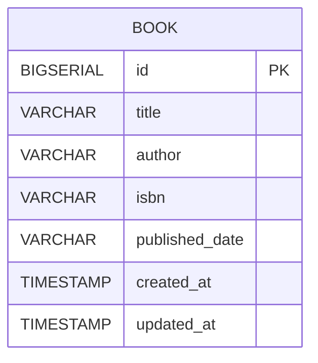

# 📚 Book Management Service

Book Management Service adalah REST API sederhana berbasis **Spring Boot** untuk mengelola data buku (CRUD).  
Project ini menggunakan **PostgreSQL**, **Spring Data JPA**, **Lombok**, dan **validation**.

---

## 🚀 Tech Stack

- Java 17
- Spring Boot 4.0.2
- Spring Web MVC
- Spring Data JPA
- PostgreSQL
- Lombok
- JUnit & Mockito (Testing)

---

## ⚙️ Configuration

### application.properties

```properties
spring.application.name=book-management-service

# ===================
# DATABASE CONFIG
# ===================
spring.datasource.url=jdbc:postgresql://localhost:5432/book_management
spring.datasource.username=postgres
spring.datasource.password=postgres
spring.datasource.drive-class-name=org.postgresql.Driver

spring.jpa.hibernate.ddl-auto=update

```

## 🔐 Environment Variables

sesuaikan setup application.properties:

```properties
spring.datasource.url=${DB_URL}
spring.datasource.username=${DB_USERNAME}
spring.datasource.password=${DB_PASSWORD}

```

## ▶️ How To Run The Project

**1. Clone Repository**
```bash
git clone https://github.com/username/book-management-service.git
cd book-management-service
```
**2. Build Project**
```bash
mvn clean install
```
**3. Run Application**
```bash
mvn spring-boot:run
```

## 📮 Postman Collection

You can test all API endpoints using the Postman collection provided below:

- Import file:  
  `postman/book-management.postman_collection.json`

Steps:
1. Open Postman
2. Click **Import**
3. Select the JSON file
4. Run the requests

Or access the public Postman collection here:

👉 [View the Postman Collection](https://www.postman.co/workspace/My-Workspace~fd01e8a2-14fa-4bbd-8a45-fe491f1a4029/collection/17876581-5cfa48e8-652a-475b-8ff8-bb99dc03eef6?action=share&creator=17876581)

Or you can download collection from this google drive if the link above cant be used.

👉 [View the Postman Collection from GDRIVE](https://drive.google.com/drive/folders/1JHynoQom18lBFQcUC145e3SQX6814ffR?usp=sharing)

## 📊 ERD (ENTITY RELATIONSHIP DIAGRAM)


## BOOK API SPECS

## ADD BOOK

Endpoint : POST /api/books
Content-Type: application/x-www-form-urlencoded

Request :
title=Clean Code
&author=Robert C. Martin
&isbn=9780132350884120
&publishedDate=2008-08-01

Response Body(success) :

```json
{
    "data": "Book has successfully added",
    "errors": null,
    "isSuccess": true
}
```

Response Body(failed) :

```json
{
    "data": null,
    "errors": "title: must not be blank",
    "isSuccess": false
}
```

## GET BOOKS

Endpoint : GET /api/books

Response Body(success) :

```json
{
    "data": [
        {
            "id": 10,
            "title": "Clean Code",
            "author": "Robert C. Martin",
            "isbn": "9780132350884120",
            "publishedDate": "2008-08-01"
        },
        {
            "id": 11,
            "title": "Clean Code",
            "author": "Robert C. Martin",
            "isbn": "9780132350884120",
            "publishedDate": "2008-08-01"
        }
    ],
    "errors": null,
    "isSuccess": true
}
```

## GET BOOK BY ID

Endpoint : GET /api/books/{id}

Response body (success) :

```json
{
    "data": {
        "id": 10,
        "title": "Clean Code",
        "author": "Robert C. Martin",
        "isbn": "9780132350884120",
        "publishedDate": "2008-08-01"
    },
    "errors": null,
    "isSuccess": true
}
```

Response body(failed) :

```json
{
    "data": null,
    "errors": "404 NOT_FOUND \"Book not found\"",
    "isSuccess": false
}
```

## PUT BOOK BY ID

Endpoint : /api/books/{id}
Content-Type: application/x-www-form-urlencoded
Request :

title=Clean Code
&author=Robert C. Martin
&isbn=9780132350884120
&publishedDate=2008-08-01

Response body (success) :

```json
{
    "data": {
        "id": 11,
        "title": "Clean Code (Revised Edition)",
        "author": "Robert C. Martin",
        "isbn": "9780132350884120",
        "publishedDate": "2008-08-01"
    },
    "errors": null,
    "isSuccess": true
}
```

Response body (failed) :

```json
{
    "data": null,
    "errors": "404 NOT_FOUND \"Book not found\"",
    "isSuccess": false
}
```

## PATCH BOOK BY ID

Endpoint : /api/books/{id}
Content-Type: application/x-www-form-urlencoded
Request :

isbn=9780132350884120
&publishedDate=2008-08-01

Response body(success) :

```json
{
    "data": {
        "id": 11,
        "title": "Clean Code",
        "author": "Robert C. Martin",
        "isbn": "9780132350884120",
        "publishedDate": "2008-08-01"
    },
    "errors": null,
    "isSuccess": true
}
```

Response body(failed) :

```json
{
    "data": null,
    "errors": "404 NOT_FOUND \"Book not found\"",
    "isSuccess": false
}
```

## DELETE BOOK BY ID

Endpoint : /api/books/{id}

Response body(success) :

```json
{
  "data": "Book has successfully deleted",
  "errors": null,
  "isSuccess": true
}
```

Response body(failed) :

```json
{
    "data": null,
    "errors": "404 NOT_FOUND \"Book not found\"",
    "isSuccess": false
}
```